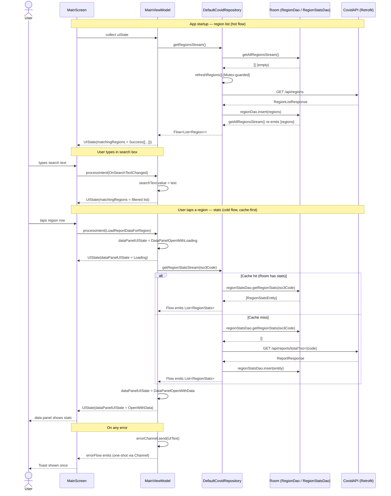

# Technical Assessment

Rod Bailey
Thursday 8 February 2024

# Summary

This is an Android technical exercise centered on the presentation of COVID data from an online source at `https://covid-api.com/`. The following libraries are used:

- **Jetpack Compose** for UI
- **Room** for caching of loaded data (country list only)
- **Retrofit** for network communications
- **GSON** for parsing of JSON
- **Espresso** for instrumented testing

# Build

This Github repository contains a single Android Studio project that is ready to build and install.
It has been built with `Android Studio Hedgehog | 2023.1.1 Patch 2`

# Architecture

The app has a layered architecture. The UI layer uses the MVVM pattern with the UI in `Compose` and the `ViewModel` class from the Android Architecture Components. The data layer exposes a `Repository` that fetches data either from the network or the local database.

# Data Flow

The following sequence diagram shows the three main data flows: region list load on startup, search filtering, and stats fetch on region tap.

# UI Design

The UI conforms to the Material Design 3 guidelines.

# Screen

The app has only a single screen. A search field is used to filter the country list below it. The circular icon at the right of the search field provides a way to access "Global" statistics. The card at the bottom of the screen displays the covid statistics for the currently selected country (or Global). Tapping the card hides it.

The country list is cached in a local database and the only way to clear the database is to uninstall the application.

# Video

The following video demonstrates the application in use. You may need to download the video file to your own machine in order to watch it. It is stored within this repo at `/doc/sample_video.mp4`

# Tests

There is a suite of 62 *instrumented tests* that cover the Compose interface, the ViewModel behind it and all the classes in the domain and data layers.

There is a small suite of 6 *un-instrumented tests*.

The Jacoco coverage report says the instrumented tests give a coverage of 71%, but 100% of production code is actually exercised by these tests. The un-executed code consists of Composable Previews and schema validation code autogenerated by Room.

