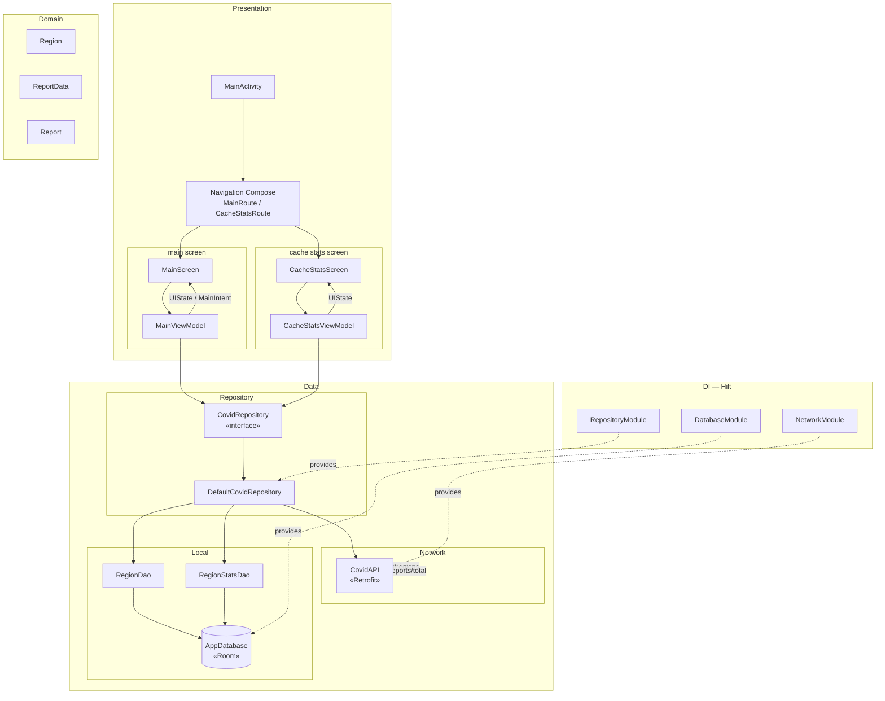
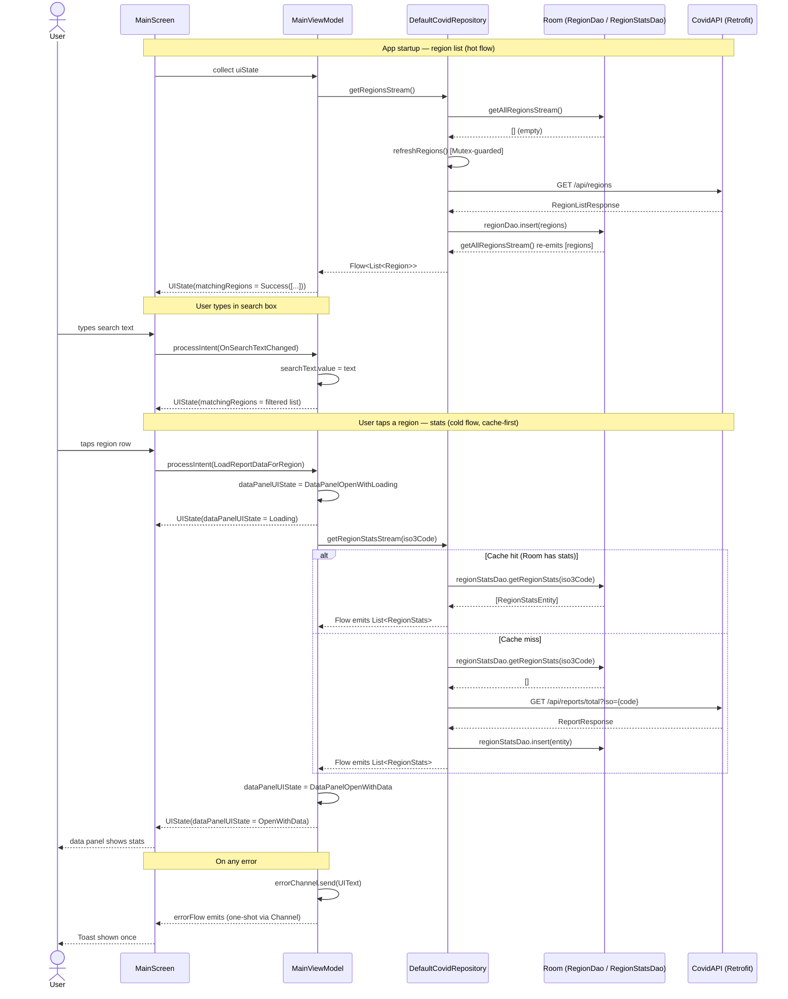

# Technical Assessment

Rod Bailey
Thursday 8 February 2024. Updated Wednesday 10 June 2026.

## Summary

This is an Android technical exercise centered on the presentation of COVID data from an online source at `https://covid-api.com/`. The following libraries are used:

- **Jetpack Compose** for UI
- **Room** for caching of loaded data (country list only)
- **Retrofit** for network communications
- **GSON** for parsing of JSON
- **Espresso** for instrumented testing
- **Compose Testing** for UI testing
- **JUnit** for un-instrumented testing
- **Jacoco** for code coverage reporting
- **Hilt** for dependency injection
- **Kotlin Coroutines** for asynchronous programming
- **Kotlin Flow** for reactive programming
- **ViewModel** for state management
- **Navigation Compose** for navigation between screens
- **Mermaid** for architecture and sequence diagrams in this README

The code was originally developed by hand in 2024, and then refactored, improved and augmented with tests using Claude Code in 2026.

## Build

This Github repository contains a single Android Studio project that is ready to build and install.
It has been built with `Android Studio Panda 4 | 2025.3.4 Patch 1`

## Architecture

The app has a layered architecture. The UI layer uses the MVVM pattern with the UI in `Compose` and the `ViewModel` class from the Android Architecture Components. The data layer exposes a `Repository` that fetches data either from the network or the local database.

## Data Flow

The following sequence diagram shows the three main data flows: 

- Region list load on startup, 
- Search filtering, and 
- Covid stats fetch when region is tapped.

The diagram also shows the error path, which can be triggered by any of the above flows. The error path is not shown in the other flows for clarity, but it is always possible for an error to occur at any point in the data flow, and the app will respond by showing a one-shot Toast message to the user.

## UI Design

The UI conforms to the Material Design 3 guidelines and has two screens: 

The **main screen** contains a search field in which the user types the name of a country whose Covid stats they are interested in. The list of available countries is filtered by the search text and presented underneath the search field. The circular icon at the right of the search field provides a way to access "Global" statistics. The card that pops up  at the bottom of the screen displays the covid statistics for the currently selected country (or Global). Tapping the card hides it. The country list is cached in a local database and the only way to clear the database is to uninstall the application.

The **secondary screen** is accessed by triple-tapping anywhere on the main screen. This screens shows statistics relating to the internal caching of covid data. 

## Test Coverage

At the time of writing there is a suite of 86 *instrumented tests* and 14 unit tests. Jacoco coverage is measured against non-Compose production code only (Compose UI, generated Hilt/Room code, and preview functions are excluded). The instrumented tests do the heavy lifting; the unit tests cover utility functions only.

| Metric      | Unit tests | Instrumented tests |
|-------------|------------|--------------------|
| Instruction | 8.4%       | **75.6%**          |
| Branch      | 0.0%       | **72.2%**          |
| Line        | 12.8%      | **76.2%**          |
| Method      | 14.2%      | **80.7%**          |
| Class       | 11.8%      | **78.4%**          |

